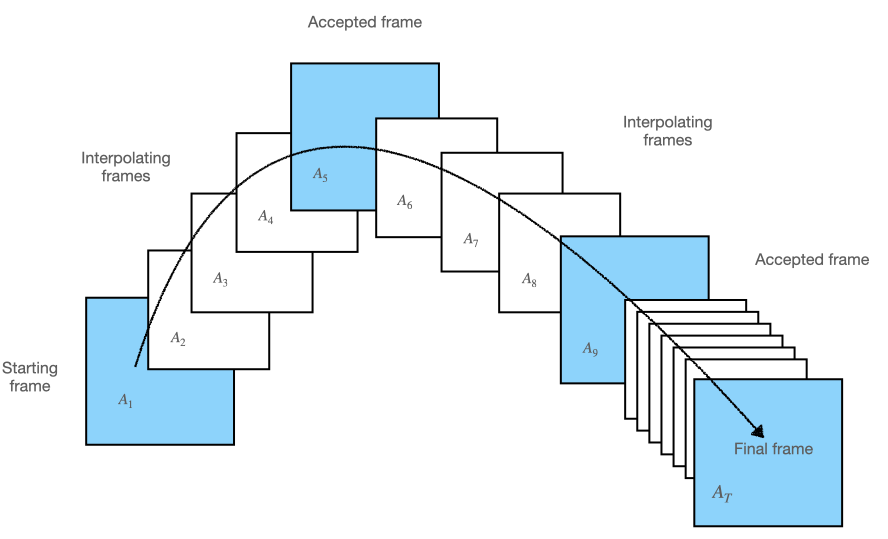
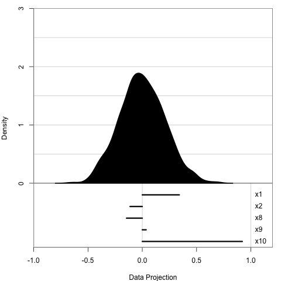
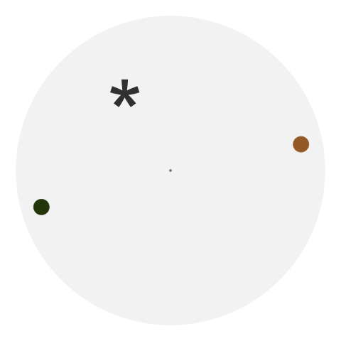
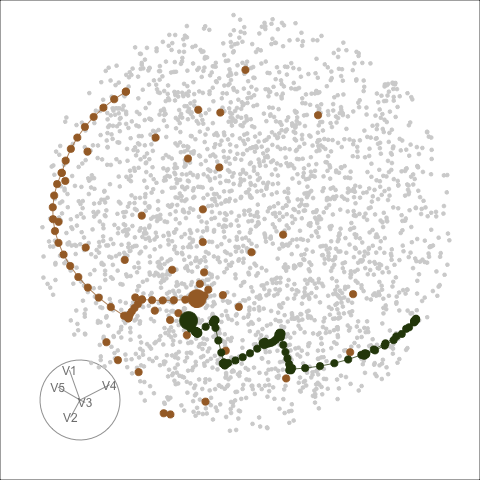

```{r setup, include=FALSE}
knitr::opts_chunk$set(echo = FALSE, 
                      message = FALSE, 
                      cache = TRUE, 
                      fig.retina = 2,
                      fig.path = "figures/")
library(ferrn)
library(tidyverse)
library(icon)
library(patchwork)
library(tourr)
files <- paste0("data/", list.files(here::here("data")))
purrr::walk(.x = files, ~load(here::here(.x), env = globalenv()))
```

```{r titleslide, child="components/titleslide.Rmd"}
```

???

- Hi everyone, 
- my name is Sherry Zhang, a PhD student from Monash University in Australia
- Today I will be talking about ...
- This is a work supervised by 
---

# Motivation

> The work also reveals inadequacies in the tour optimization algorithm, that may benefit from newly developed techniques and software tools. (Laa & Cook, 2020)

.pull-left[
- For simulated data, the optimisers
  - often failed at finding the expected maxima, or 
  - would only get close but not reach the maxima
- For noisy index functions it failed completely
]

.pull-right[

```{r motivation, fig.height=5}
before %>% explore_trace_interp(cutoff = 100) + scale_color_continuous_botanical()
```


]


???

- project, motivated by ursula and Di's work, that apply guided tour to physics problems. 
- this is what they write in the paper
- they find that ...
- on the right is an example where
  - the optimiser could have finished at a better place but it doesn't

---

# How to solve this problem?

To understand where the optimisers were failing, ideally we need to visualise the **space** and the **paths** that the optimisers take through the space. 
  
--

  - the space is the set of all d-dimensional projections of p-dimensional space.

???

intro: 

- This is an interesting visualisation problem because

---

# What is projection pursuit?

.pull-left[
Data: $\mathbf{X}_{n \times p}$ Basis: $\mathbf{A}_{p\times d}$ 

Projection: $\mathbf{Y} = \mathbf{X} \cdot \mathbf{A}$

Index function:   $f: \mathbb{R}^{n \times d} \mapsto \mathbb{R}$

<br>
**holes index:**

  $\propto 1 -\frac{1}{n} \sum_{i = 1}^n \exp(-\frac{1}{2} y_i y_i^{\prime})$

<br>
density $\uparrow$, index value $\uparrow$

<br>

**optimisation: **  
  $$\arg \max_{\mathbf{A} \in \mathcal{A}} f(\mathbf{X} \cdot \mathbf{A})  ~~~ s.t. ~~~ \mathbf{A}^{\prime} \mathbf{A} = I_d$$
  

]

.pull-right[

```{r calc-index-val, echo = FALSE, fig.width=7.5}
index_val <- boa %>% 
  dplyr::select(-x4) %>% 
  mutate(across(x1:x10, ~exp(-1/2 *.x ^2))) %>%
  summarise(across(contains("x"), ~sum(.x))) %>% 
  mutate(across(contains("x"), ~(1-1/1000*(.x))/(1-exp(-1/2)))) %>% 
  pivot_longer(cols = x1: x10, names_to = "var", values_to = "index") %>% 
  mutate(x = -2.5, y = 0.75)


boa %>%
  dplyr::select(-x4) %>% 
  pivot_longer(cols = x1:x10, names_to = "var", values_to = "value") %>%
  mutate(var = factor(var, levels = paste0("x", c(1:3, 5:10)))) %>% 
  ggplot(aes(x = value)) +
  geom_density() +
  geom_label(data = index_val, aes(x = x, y = y, 
                                   label = round(index, 3))) +
  facet_wrap(vars(fct_relevel(var, "x10", after = 9)))
```
    
]


???
To understand guided tour, we first need to talk about projection pursuit
- the data is a matrix ..., basis
- Projection basis A of dimension ... characterises the direction from which the data get projected;
- projection 
- Index function: maps the projection to a scalar
- Throughout this presentation until the case study, we will be using an index function called holes index
  - will not show the full formula here, but it is proportional to 1 - something that looks like a standardised normal density
- on the right I have calculated the index value for different 1D projections and we can observe that 
  - for those projections that have high density regions, for examples, ..., it has an higher index value
- The optimisation we have is to: max the index function, subject to orthonormality constraint

---
# Three random search optimisers

- Creeping random search (CRS):
  - randomly sample a basis and evaluate its index value
  - accept if it has a higher index value, discard if lower
- Simulated annealing (SA):
  - a second chance to be accepted with probability
  $$P= \min\left\{\exp\left[-\frac{\mid I_{\text{cur}} - I_{l} \mid}{T(l)}\right],1\right\}$$
  where $I_{(\cdot)}$ is the index value, $T(l) = \frac{T_0}{\log(l + 1)}$, $l$ is the # of eval in the current iter. 
  - As $l$ increases, $T(l)$ decreases, and the probability for accepting inferior bases decreases

???

To solve this optimisation problem, we have three optimisers. All of which are random search algorithms

creeping random search: 
  - sample, satisfy orthonormality, evaluate
  - candidate, accept

simulated annealing:
  - follows the same as CRS in sampling and accepting better bases, but
  - it has a different design for bases that have lower index value. These bases have
  - that is to say, the chance to accept a worse basis decreases as more bases are evaluated
  
---
# Three random search optimisers 

(Cont.)

- Pseudo derivative (PD): 
  - randomly sample 5 directions close to the current and pick the most promising one
  - search along a straight line (on the sphere) for the best candidate
  - same acceptance rule as CRS
  
???

Pseudo derivative:
  - flavour, gradient a'scent, as it first find a promising direction and then compute a step size
  - we don't use derivatives here, hard to operate on a matrix basis. Instead, 

---
# Projection pursuit with guided tour

```{r echo = FALSE, fig.align="center"}

```

* projection pursuit maximises the index function to iteratively find better basis/ projection (**blue frames**)
* guided tour chains these projections together through interpolation (**white frames**) and produces an smooth animation (**see next slide `r anicon::faa("long-arrow-alt-right", animate = "horizontal", color = "D93F00")`**)


???

This illustration shows how projection pursuit and guided tour works together

Those are shown in the blue frames

---
# An example

```{r eval = FALSE}
set.seed(123456)
render_gif(boa5,
           tour_path = guided_tour(holes(), d = 1, 
                                   search_f = search_geodesic),
            display_dist(),
           frames = 45,
           rescale = FALSE,
           gif_file = here::here("img", "tour-demo.gif"))

```

.pull-left[
```{r}

```

]
.pull-right[

1D projection: histogram

<br>

5 simulated variables

  - $x_2$ is mixture normal $0.5 \mathcal{N}(-3, 1) + 0.5 \mathcal{N}(3, 1)$
  - others are random normal

<br>

We expect:

  - $x_2$ has weight close to 1
  - others are close to 0
]


???

Here is how the animation looks like:

- We use histogram to display 1D projections
- In this example, there are 5 variables, X2 is a mixture normal and others are random normal
- We expect: X2 to have a weight close to 1 and others close to 0

<br> </br>

- In this simple example, the optimiser works well to find the optimum
- but this is not the case for all the problem, as we see in the literature
- so we need some visual tools to help us diagnose where things go wrong

---
# Ferrn package

.left-col[
**Four functions to explore the trace and space of the optimisers: **

- `explore_trace_search()`
- `explore_trace_interp()`
- `explore_space_pca()`
- `explore_space_tour()`

**Botanical theme:**

- `scale_color_continuous_botanical()`
- `scale_color_discrete_botanical()`


]
.right-col[

**To produce plots: **
```{r eval = FALSE, echo = TRUE}
<data> %>% 
  <explore_*>() %>% 
  <scale_*>()

```


]

<br>
<br>
<br>
<br>
<br>
<br>
<br>
<br>
<br>
<br>
<br>
<br>
<br>
<br>


.institute-size[
  `*` The syntax to adjust color in `explore_space_tour()` is slightly different
]


???

- This work leads to an R package, ferrn, where we create 4 diagnostic plots. Two for exploring the trace and two for space
- There is also a botanical theme for scale the color
- To produce a plot, you need to pipe the data collected from the optimisation into one of the explore functions and make color adjustment using the botanical palette
- Due to the time limit of this talk, I will go through the two space plots here and later you will have the chance to see the trace plot

---
# `explore_space_pca()`

.pull-left[
```{r pca-plot}
pca_plot <- bind_rows(holes_1d_geo, holes_1d_better) %>%
  bind_theoretical(matrix(c(0, 1, 0, 0, 0), nrow = 5),
                   index = tourr::holes(), raw_data = boa5)  %>%
  explore_space_pca(group = method, details = TRUE,
                    interp_size = 1, ratio = 3) +
  scale_color_discrete_botanical()
pca_plot
```
]


???

This is the first space plot
  - as mentioned earlier, the data to project is the five variable data we see just before and the index function used is the holes index

First I'm going to tell you how this plot is made and then what we can learn from it
- We have all the bases evaluated in the optimisation collected as a data object - these are the coloured dots 
- we also have random bases sampled from the 5D space, these are used to draw the space 
- we then perform PCA on these two sets of bases and take the first two to create this plot 

In this plot 
- The star is the theoretical best basis, corresponds to 1 in $x_2$ and 0 in others
- we have two paths, CRS in brown and PD in green
- CRS evaluates random points in the space so you can see dots everywhere
- PD evaluates 5 directions locally, so you can see dots scattered around an accepted basis
- The paths are interpolation between bases accepted by projection pursuit

This plot tells us that ... and it helps us to ...

we can also make an animated version of this plot 
  - here we can see clearer where each optimiser starts 
  - an additional info, learn 

--

.pull-right[

- Both optimisers find the optimum but PD gets closer
- Visually understand how the optimisers work 

]

--

.pull-right[

```{r eval = FALSE}
dt <- dplyr::bind_rows(holes_1d_geo, holes_1d_better) %>%
  bind_theoretical(matrix(c(0, 1, 0, 0, 0), nrow = 5),
                   index = tourr::holes(), raw_data = boa5)
ani <- dt %>%
  explore_space_pca(group = method, animate = TRUE, interp_size = 3,
                    theo_size = 45, start_size = 10, end_size = 20) +
  theme(legend.position = "none") +
  scale_color_discrete_botanical(palette = "fern")
gganimate::anim_save(ani, filename = here::here("img", "pca.gif"))

```


```{r out.width="70%", fig.align="center"}
 
```

]


--

.pull-right[

CRS finds the optimum faster!

]

---
# `explore_space_tour()`

The same two paths but on the 5D full space. 

.pull-left[

```{r eval = FALSE}
prep <- prep_space_tour(dplyr::bind_rows(holes_1d_better, holes_1d_geo), 
                        flip = TRUE, group = method, 
                        palette = botanical_palettes$fern[c(1,6)], 
                        axes = "bottomleft",
                        point_size = 2, end_size = 5)

set.seed(123456)
render(
  prep$basis,
  tour_path = grand_tour(),
  dev = "png",
  display = display_xy(col = prep$col, cex = prep$cex, pch = prep$pch,
                       edges = prep$edges, edges.col = prep$edges_col,
                       axes = "bottomleft"),
  rescale = FALSE,
  frames = 100,
  here::here("img","tour", "tour-frame%03d.png")
)


# render gif
set.seed(123456)
render_gif(
  prep$basis,
  tour_path = grand_tour(),
  display = display_xy(col = prep$col, cex = prep$cex, pch = prep$pch,
                       edges = prep$edges, edges.col = prep$edges_col,
                       axes = "bottomleft"),
  rescale = FALSE,
  frames = 200,
  gif_file = here::here("img","tour.gif")
)
```


```{r}
knitr::include_graphics("./img/tour.gif") 
```

]

???

What I'm showing you now is the same two paths but on the full space. 
  - The full space is a 5D unit sphere since the orthonormality constraint requires the square of all the entries adds up to one
  - Here is a frame in the animation that is most similar to the previous PCA view
What we learn here is that
  - PCA, maximises variance, most spread, full space plot allows you to see the same path from different angles.


--


.pull-right[

```{r 1d-sphere-frame, out.width="110%", out.height="120%"}
p1 <-  %>% png::readPNG() %>% grid::rasterGrob() %>% wrap_plots()
p1 / pca_plot
```

]


---
# 2D basis space

The basis space is no longer a sphere, but a torus!

.pull-left[
```{r eval = FALSE}
proj_d <-  2 # 2D because then you have 2 orthogonal circles
d <- 6
n_point <- 5000
set.seed(123456)
random <- map(1:n_point, ~basis_random(n = d/proj_d,  d=proj_d)) %>%
  purrr::flatten_dbl() %>% matrix(ncol = d, byrow = TRUE) %>% as_tibble()

set.seed(123)
render(
  random[,1:d],
  tour_path = grand_tour(),
  dev = "png",
  display = display_xy(axes = "off", col = "grey60", cex = 0.5),
  rescale = FALSE,
  frames = 100,
  here::here("img","torus", "torus%03d.png")
)

# render gif
set.seed(123)
render_gif(
  random[,1:d],
  tour_path = grand_tour(),
  display = display_xy(axes = "off", col = "grey60", cex = 0.5),
  rescale = FALSE,
  frames = 100,
  gif_file = here::here("img","torus.gif")
)
```

```{r out.width = "100%"}
knitr::include_graphics("./img/torus.gif")
```

]

.pull-right[
```{r 2D-torus-frames, out.width = "100%"}
frames <- c("001", "017", "064", "068", "075", "100")
ani <- paste0("./img/", "torus/", "torus", frames, ".png")
rl <- lapply(ani, png::readPNG)
gl <-  lapply(rl, grid::rasterGrob)
wrap_plots(gl)
```

Basis $\mathbf{A}_{p\times d}$ where $d = 2$ 

]


???

- similarly we can generate random 2D bases and animate it with the optimisation path embeded
- Here I have generated the 2D basis space and captured some frames from the animation
- This time, 

---

# Case study: optimising a noisy index

.pull-left[
### Which optimiser(s) work and which didn't?

New index: $$I(n) = \max \left[F_{Y}(n) - F_{\mathcal{N}}(n)\right]$$ 

<small> where $F_{.}(n)$ is the ECDF function </small>

```{r noisy-index-compare, fig.height = 4}
set.seed(123456)
d <- 1
basis1 <- tourr::basis_random(ncol(boa5), d)
basis2 <- tourr::basis_random(ncol(boa5), d)
geo <- tourr::geodesic_path(basis1, basis2)

cur_dist <- 0
target_dist <- geo$dist
pos <- seq(cur_dist, target_dist, length.out = 100)
interp <- tourr:::geodesic_info(basis1, basis2)

calc_interp_kol <- function(fraction){
  basis <- tourr:::step_fraction(interp = interp, fraction = fraction)
  proj <- as.matrix(boa5) %*% basis
  index <- tourr::norm_kol(nrow(boa5))
  index(proj)
}

calc_interp_holes <- function(fraction){
  basis <- tourr:::step_fraction(interp = interp, fraction = fraction)
  proj <- as.matrix(boa5) %*% basis
  index <- tourr::holes()
  index(proj)
}

dt <- bind_rows(tibble(index_val = map_dbl(pos, calc_interp_kol)) %>% mutate(id = row_number(), index = "noisy"),
          tibble(index_val = map_dbl(pos, calc_interp_holes)) %>% mutate(id = row_number(), index = "holes"))

dt %>% 
  ggplot(aes(x = id, y = index_val, group = index)) + 
  geom_line() + 
  facet_wrap(vars(index), scales = "free_y") + 
  ylab("Index value") + 
  xlab("Time")


```


]

???

Now I'm presenting a case study on how visual diagnostics informs us about optmising a noisy index.

- The new index we use is based on the kolmogorove test, defined here.  
- The plot on the left shows how the index value changes when interpolating between two random bases
- What I do is to generate two random bases in the 5D space and ask guided tour to interpolate 100 frames in between. The index value of all the frames are calculated and arranged by its natural order to make this plot.
- what we see here is that, comparing to the holes index, the new index
  1) has a different range, and 
  2) also it is non-smooth
  - These add challenges to the optimisation
- On the right are the trace and space plot of the three optimisers I introduced earlier
- In the trace plot, the x-axis shows the natural order of time, y axis is the index value. The dashed horizontal line on the top is the index value of the theoretical best basis. 
  - we see here that the first optimiser, PD, fails to optimise the noisy index while CRS and SA are getting close to this theoretical best
- From the space plot, we can also see the success of CRS and SA but they are taking different approaches to find the final basis.
  - CRS extensively evaluates points in the space before accepting a new basis to interpolate - thus we see lots of dots here but the interpolation path is short, while
  - SA widely accepts new basis and performs interpolation and only starts to reject towards the end - thus we see a long interpolation path but few points being evaluated

--

.pull-right[

```{r noisy-performance, fig.align="center", message=FALSE, warning = FALSE}
index <- tourr::norm_kol(nrow(boa5))
theo_best_index_val <- index(as.matrix(boa5) %*% matrix(c(0, 1, 0, 0, 0), nrow = 5, ncol = 1))

dt <- dplyr::bind_rows(kol_1d_geo, kol_1d_better, kol_1d_better_random) %>%
  bind_theoretical(matrix = matrix(c(0, 1, 0, 0, 0), ncol = 1), tourr::norm_kol(nrow(boa5)), raw_data = boa5)

p1 <- dt %>%
  explore_trace_interp(group = method, color = method, accuracy_y = 0.02) +
  geom_hline(yintercept = theo_best_index_val, linetype = 2, color = "black") +
  scale_color_discrete_botanical() +
  facet_wrap(vars(fct_relevel(method, c("PD", "CRS", "SA"))), scales = "free_x")

pca <- dt %>%
  compute_pca(group = method) %>%
  purrr::pluck("aug")

p2 <- pca %>%
  explore_space_pca(group = method, pca = FALSE, details = FALSE, start_size = 3, interp_size = 0.5, end_size = 5) +
  add_search(dt = pca %>% group_by(method) %>% filter(str_detect(info, "search")) %>% filter(tries != max(tries)),
             search_size = 0.5, search_col = method, search_alpha = 0.2) +
  add_dir_search(dt = pca %>% filter(method == "PD") %>% get_dir_search(ratio = 10) %>% filter(tries != max(tries)),
                 dir_col = method, dir_alpha = 0.2) +
  scale_color_discrete_botanical() +
  theme(legend.position = "none") +
  facet_wrap(vars(fct_relevel(method, c("PD", "CRS", "SA"))))

(p1 / p2)
```
]

---

# Summary

- We have developed specialised visualisation tools to diagnose optimisation in projection pursuit guided tour


- This allows us to understand algorithms that are not obvious to the end users

<br>

**For tourr developers:**
- Provides tools to test new optimisers and optimisation of new indexes

**For algorithm developers:**
- Can be seen as a work to enhance the interpretability of black-box optimsimation algorithms

---

```{r endslide, child="components/endslide.Rmd"}
```